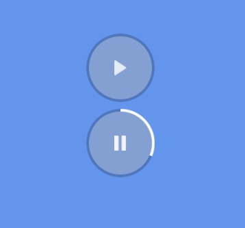

# vue-audio-mini

[vue-audio-mini 演示预览地址](https://lisiyizu.github.io/vue-audio-mini)

## Vue基友交流群: 590688906



通过以下demo来实现

###app.vue代码如下

```html
<template>
  <div id="app">
    <div v-for='item in audioList' style='margin:10px;'>
       <vue-audio-mini :model.sync='item' :callback='clickAudio'></vue-audio-mini>
    </div>
  </div>
</template>

<script>
export default {
  name: 'app',
  data(){
    return {
      audioList:[{
        elid:"audio-ctr-1",
        elclass:"audio-ctr-1",
        state:-1,
        src:"http://oot79f1a9.bkt.clouddn.com/test1.mp3"
      },{
        
        elid:"audio-ctr-2",
        elclass:"audio-ctr-2",
        state:-1,
        src:"http://lisiyizu.github.io/%E4%B8%8B%E4%B8%80%E7%AB%99%E5%A4%A9%E5%90%8E.mp3"
      }]
    }
  },
  methods:{
    clickAudio(m){
      this.audioList.forEach(item=>{
          if(m!=item) {
            // 重置音频的进度
            item.state=-1;
            document.querySelector("."+item.elclass+" .bar").style='';
          }
      })
    }
  },
  components:{
     'vue-audio-mini':require("./components/vue-audio-mini.vue")
  }
}
</script>

<style>
body{
    background: cornflowerblue;
}
#app {
  font-family: 'Avenir', Helvetica, Arial, sans-serif;
  -webkit-font-smoothing: antialiased;
  -moz-osx-font-smoothing: grayscale;
  color: #2c3e50;
  margin-top: 60px;
}
</style>


```

###vue-audio-mini/初始化参数
<table  border="0" align="left">
	<tbody>
		<tr>
			<td >参数</td>
			<td >类型</td>
			<td >默认值</td>
			<td >描述</td>
		</tr>
		<tr>
			<td >object</td>
			<td >Object</td>
			<td >-</td>
			<td >音频对象</td>
		</tr>
		<tr>
			<td >callback</td>
			<td >Function</td>
			<td >-</td>
			<td >点击播放/停止事件</td>
		</tr>
	</tbody>
</table>


## Build Setup

``` bash
# install dependencies
npm install

# serve with hot reload at localhost:8080
npm run dev

# build for production with minification
npm run build
```

For detailed explanation on how things work, consult the [docs for vue-loader](http://vuejs.github.io/vue-loader).
